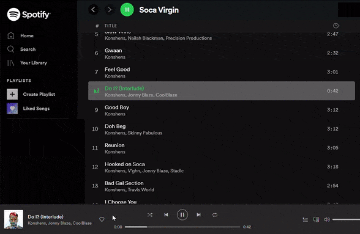
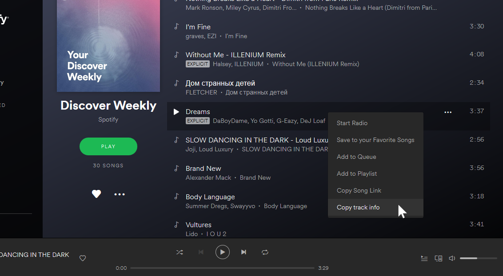

# Spotify Web - Copy track info to clipboard (Userscript)

This is a userscript (or greasemonkey script) that adds an entry to the context menu (right mouse click) of the Spotify Web Player that let's you copy the selected song name and artist to the clipboard.

It's primarily designed for Firefox and Chrome with
[Greasemonkey ](https://addons.mozilla.org/firefox/addon/greasemonkey/)
,
[Tampermonkey](https://www.tampermonkey.net/)  
or
[FireMonkey ](https://addons.mozilla.org/en-US/firefox/addon/firemonkey/).
General information about userscripts and how to use them can be found at [openuserjs.org/about/Userscript-Beginners-HOWTO](https://openuserjs.org/about/Userscript-Beginners-HOWTO).

[**Click here for install**](https://openuserjs.org/install/cuzi/Spotify_Web_-_Copy_track_info_to_clipboard.user.js)

Screenshot:

